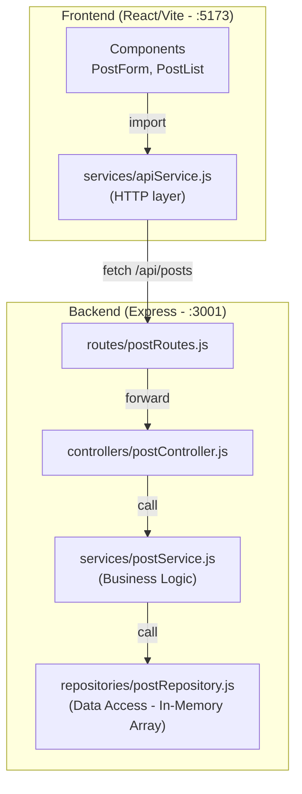

# Mini CMS — Walkthrough

## Overview
Built a full-stack CMS with **strict Layered Architecture** using React (Vite) + Node.js (Express) with an in-memory database.

## Architecture



## Project Structure
```
Demo/
├── backend/
│   ├── server.js                          # Express entry point
│   ├── package.json
│   └── src/
│       ├── routes/postRoutes.js           # API endpoint definitions
│       ├── controllers/postController.js  # HTTP request/response handling
│       ├── services/postService.js        # Business logic & validation
│       └── repositories/postRepository.js # Data access (in-memory array)
└── frontend/
    ├── index.html
    ├── vite.config.js                     # Vite config with API proxy
    ├── package.json
    └── src/
        ├── main.jsx
        ├── App.jsx                        # Main app (state orchestration)
        ├── index.css                      # Premium dark theme CSS
        ├── services/apiService.js         # Centralized HTTP requests
        └── components/
            ├── PostForm.jsx               # Create post UI
            └── PostList.jsx               # Display & delete posts UI
```

## Verification Results

All 3 features tested successfully via browser:

### 1. Initial UI — Empty State


### 2. Create & Read — Two Posts Created


### 3. Delete — First Post Removed


### Full Test Recording


## Start Commands

| Server   | Command         | URL                     |
|----------|-----------------|-------------------------|
| Backend  | `node server.js` (from `backend/`) | http://localhost:3001 |
| Frontend | `npm run dev` (from `frontend/`)   | http://localhost:5173 |
